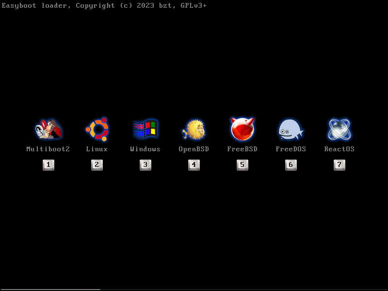

Easyboot
========

[Easyboot](https://gitlab.com/bztsrc/easyboot) é um *gestor* de arranque completo e criador de imagens de disco de arranque que
pode carregar vários kernels de sistema operativo e kernels compatíveis com Multiboot2 em vários formatos binários.

NOTA: Se procura um *carregador* de arranque que carregue apenas um kernel, dê uma vista de olhos ao irmão mais novo do **Easyboot**,
[Simpleboot](https://gitlab.com/bztsrc/simpleboot).

Reconhecimento
--------------

Este projeto não teria sido possível sem o apoio da [Free Software Foundation Hungria](https://fsf.hu/nevjegy).
O projeto foi criado no âmbito do Concurso de Software Livre 2023 da FSF.hu.

Vantagens sobre o GRUB
----------------------

- instalador multilingue, fácil de usar e sem dependências
- não inchado, tem apenas cerca de 0,5% do tamanho do GRUB
- fácil de configurar, com verificador de sintaxe
- corrigir facilmente tabelas ACPI com DSDT fornecido pelo utilizador
- mostra um ecrã de erro muito detalhado se o kernel desligar numa fase inicial
- Multiboot2: ponto de entrada limpo de 64 bits (sem necessidade de incorporar tags nem de código trampolim de 32 bits no kernel)
- Multiboot2: suporte para kernels de metade superior
- Multiboot2: independente do firmware, mapa de memória consistente em todas as plataformas
- Multiboot2: independente do firmware, framebuffer consistente em todas as plataformas
- Multiboot2: as informações EDID do monitor também são fornecidas
- Multiboot2: se solicitado, inicia o kernel em todos os núcleos do processador (suporte SMP)
- existe também um plugin para simular o arranque do GRUB com todas as suas armadilhas e bugs.

Kernels suportados: [Multiboot1](https://www.gnu.org/software/grub/manual/multiboot/multiboot.html) (ELF32, PE/COFF, a.out;
BIOS, UEFI, RPi), [Multiboot2](docs/pt/ABI.md) (ELF32, ELF64, PE32+/COFF, a.out; BIOS, UEFI, RPi),
[Linux](https://www.kernel.org/doc/html/latest/arch/x86/boot.html) (BIOS, UEFI, RPi),
[Windows](https://learn.microsoft.com/en-us/windows-hardware/drivers/bringup/boot-and-uefi) (UEFI),
[OpenBSD](https://man.openbsd.org/boot.8) (BIOS, UEFI),
[FreeBSD](https://docs.freebsd.org/en/books/handbook/boot/) (BIOS, UEFI),
[FreeDOS](https://www.freedos.org/) (BIOS), [ReactOS](https://reactos.org/) (BIOS),
[MenuetOS](https://menuetos.net/) 32 / 64 (BIOS, UEFI), [KolibriOS](https://kolibrios.org/en/) (BIOS, UEFI),
[SerenityOS](https://serenityos.org/) (BIOS, UEFI), [Haiku](https://www.haiku-os.org/) (BIOS, UEFI)

Sistemas de ficheiros suportados: [FAT12/16/32](https://social.technet.microsoft.com/wiki/contents/articles/6771.the-fat-file-system.aspx),
[exFAT](https://learn.microsoft.com/en-us/windows/win32/fileio/exfat-specification),
[NTFS](https://github.com/libyal/libfsntfs/blob/main/documentation/New%20Technologies%20File%20System%20%28NTFS%29.asciidoc) (v3, v3.1),
[ext2/3/4](https://ext4.wiki.kernel.org/index.php/Ext4_Disk_Layout),
[XFS](https://mirror.math.princeton.edu/pub/kernel/linux/utils/fs/xfs/docs/xfs_filesystem_structure.pdf) (SGI),
[UFS](https://alter.org.ua/docs/fbsd/ufs/) (v2, v4.4),
[mfs](https://gitlab.com/bztsrc/minix3fs) (Minix3),
[BeFS](https://www.haiku-os.org/legacy-docs/practical-file-system-design.pdf) (Haiku),
[AXFS](https://gitlab.com/bztsrc/alexandriafs) (OS/Z)

(Quando o kernel está localizado na partição de arranque, qualquer sistema de ficheiros pode ser utilizado para root: ZFS, btrfs, etc.)

Justificativa
-------------

Criei um bootloader simples de utilizar, e os utilizadores pediam cada vez mais recursos. Eu queria manter este carregador de
arranque o mais simples possível, mas o FSF.hu suportava-o, por isso decidi bifurcá-lo e adicionar todos os recursos solicitados
neste gestor de arranque.

Esta é também uma ferramenta [sem sucção](https://suckless.org) como o Simpleboot, não tem dependências e é extremamente fácil de
utilizar:

1. crie um diretório e coloque nele os seus ficheiros de arranque, entre outras coisas, a sua configuração de menu e os plugins opcionais
2. execute o comando `easyboot (directoria de origem) (ficheiro de imagem de saída)`
3. e... pronto... não há mais nada a fazer! A imagem *Simplesmente Funciona (TM)*, fará com que os seus kernels arranquem!

Pode instalar o gestor de arranque e tornar um dispositivo ou imagem existente inicializável; ou pode criar uma imagem de arranque
novamente. Pode arrancar esta imagem numa VM ou pode gravá-la com `dd` ou [USBImager](https://bztsrc.gitlab.io/usbimager/) num
armazenamento e iniciá-la numa máquina real também.

A simplicidade é a máxima sofisticação!

Instalação
----------

Basta descarregar o binário para o seu sistema operativo. Estes são executáveis ​​portáteis, não requerem instalação e não necessitam
de qualquer biblioteca/DLL partilhada.

- [easyboot-x86_64-linux.tgz](https://gitlab.com/bztsrc/easyboot/-/raw/main/distrib/easyboot-x86_64-linux.tgz) Linux, \*BSD (1M)
- [easyboot-i686-win.zip](https://gitlab.com/bztsrc/easyboot/-/raw/main/distrib/easyboot-i686-win.zip) Windows (1M)

Além disso, pode encontrar várias soluções de empacotamento no diretório [distrib](distrib) (para Debian, Ubuntu, RaspiOS, Gentoo,
Arch).

Ao criar uma imagem (dependendo da sua configuração), também pode precisar de alguns plugins no seu `(directoria de origem)`. Pode
encontrá-los no directório [src/plugins](src/plugins) utilizando a extensão `plg`. Quando instalados a partir de um pacote, serão
colocados em `/usr/share/easyboot`.

Documentação
------------

A [documentação](docs/pt) detalhada sobre como utilizar o criador de discos de arranque e como um kernel é iniciado pode ser
encontrada no diretório docs.

Exemplo de kernel
-----------------

Se quiser escrever um kernel que possa ser carregado sem qualquer plugin utilizando o protocolo [Multiboot2 simplificado](docs/pt/ABI.md)
do **Easyboot**, dê uma vista de olhos ao directório [Simpleboot Exemplo de Kernel](https://gitlab.com/bztsrc/simpleboot/-/tree/main/example).
Ambos os carregadores utilizam o mesmo protocolo de arranque, e o kernel funciona com o **Easyboot** tal como está. Verá que não
são necessárias tags Assembly nem incorporadas, caso contrário, o código-fonte é 99,9% igual ao exemplo na especificação Multiboot2
(a única diferença é que imprime na consola série e não no ecrã de teletipo VGA, porque este último não existe nas máquinas UEFI e
RaspberryPi).

Compilação
----------

GNU/make necessário para orquestração (embora seja literalmente apenas `cc easyboot.c -o easyboot`). A cadeia de ferramentas não
interessa, qualquer compilador ANSI C serve, funciona em POSIX e WIN32 MINGW também. Basta ir ao directório [src](src) e executar
`make`. Isso é tudo. Apesar do seu pequeno tamanho, é independente e a compilação tem exatamente zero dependências de biblioteca.
Não se chama **Easyboot** à toa :-)

Para recompilar os carregadores, necessitará do [flatassembler](https://flatassembler.net), e do LLVM Clang e lld (receio que o
gcc e o GNU ld não funcionem). Mas não se preocupe, adicionei todos eles em `src/data.h` como um array de bytes, pelo que não
precisa de os compilar, a menos que realmente queira (para isso, basta apagar data.h antes de executar make).

Por outro lado, para compilar os plugins, terá de ter um compilador cruzado, seja LLVM CLang ou GNU gcc (x86_64-elf-gcc,
aarch64-elf-gcc). O repositório também inclui estes ficheiros como binários. Para fazer a recompilação, basta apagar os
ficheiros `src/plugins/*. plg` antes de executar o make.

Licença
-------

**Easyboot** é um software livre e de código aberto, licenciado nos termos da GPL versão 3 ou (na sua opinião) de qualquer versão
posterior. Consulte o ficheiro [LICENSE](LICENSE) para detalhes.

bzt
