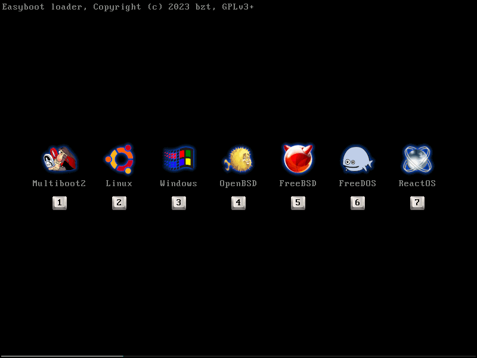

Easyboot
========

Az [Easyboot](https://gitlab.com/bztsrc/easyboot) egy minden-az-egyben rendszerbetöltő *menedzser* és indítható lemezkép készítő,
ami különböző operációs rendszer kerneleket és különféle bináris formátumú, Multiboot2 kompatíbilis kerneleket tud betölteni.

MEGJEGYZÉS: Ha csak egy sima rendszerbetöltőt keresel, ami egyetlen kernelt tölt be, akkor lásd az **Easyboot** kistestvérét, a
[Simpleboot](https://gitlab.com/bztsrc/simpleboot)-ot.

Köszönetnyilvánítás
-------------------

Ez a projekt nem jöhetett volna létre a [Free Software Foundation Hungary](https://fsf.hu/nevjegy) támogatása nélkül.
A projekt az FSF.hu Szabad Szoftver Pályázat 2023 keretén belül került megvalósításra.

Miben jobb, mint a GRUB?
------------------------

- függőségmentes, könnyen használható, többnyelvű telepítő
- bloatmentes, a mérete kb. a GRUB 0.5%-a csak
- könnyű konfigurálni, szintakszisellenőrzője is van
- könnyedén megpecseli az ACPI táblákat a felhasználó által megadott DSDT-vel
- részletes hibaüzenetet ad, ha egy kernel a korai indulása során szállna el
- Multiboot2: tisztán 64-bites belépési pont (nem kell beágyazni tegeket és 32-bites ugrókódra sincs szükség a kernelben)
- Multiboot2: felső címterű kerneleket is támogatja
- Multiboot2: förmver független, egységes memória térkép minden platformon
- Multiboot2: förmver független, egységes framebuffer minden platformon
- Multiboot2: a monitor EDID infóját is átadja
- Multiboot2: igény szerint a kernelt minden processzormagon elindítja (SMP támogatás)
- beépülővel szimulálható a GRUB bootolás is, az összes hátulütőjével és bugjával egyetemben.

Támogatott kernelek: [Multiboot1](https://www.gnu.org/software/grub/manual/multiboot/multiboot.html) (ELF32, PE/COFF, a.out;
BIOS, UEFI, RPi), [Multiboot2](docs/hu/ABI.md) (ELF32, ELF64, PE32+/COFF, a.out; BIOS, UEFI, RPi),
[Linux](https://www.kernel.org/doc/html/latest/arch/x86/boot.html) (BIOS, UEFI, RPi),
[Windows](https://learn.microsoft.com/en-us/windows-hardware/drivers/bringup/boot-and-uefi) (UEFI),
[OpenBSD](https://man.openbsd.org/boot.8) (BIOS, UEFI),
[FreeBSD](https://docs.freebsd.org/en/books/handbook/boot/) (BIOS, UEFI),
[FreeDOS](https://www.freedos.org/) (BIOS), [ReactOS](https://reactos.org/) (BIOS),
[MenuetOS](https://menuetos.net/) 32 / 64 (BIOS, UEFI), [KolibriOS](https://kolibrios.org/en/) (BIOS, UEFI),
[SerenityOS](https://serenityos.org/) (BIOS, UEFI), [Haiku](https://www.haiku-os.org/) (BIOS, UEFI)

Támogatott fájlrendszerek: [FAT12/16/32](https://social.technet.microsoft.com/wiki/contents/articles/6771.the-fat-file-system.aspx),
[exFAT](https://learn.microsoft.com/en-us/windows/win32/fileio/exfat-specification),
[NTFS](https://github.com/libyal/libfsntfs/blob/main/documentation/New%20Technologies%20File%20System%20%28NTFS%29.asciidoc) (v3, v3.1),
[ext2/3/4](https://ext4.wiki.kernel.org/index.php/Ext4_Disk_Layout),
[XFS](https://mirror.math.princeton.edu/pub/kernel/linux/utils/fs/xfs/docs/xfs_filesystem_structure.pdf) (SGI),
[UFS](https://alter.org.ua/docs/fbsd/ufs/) (v2, v4.4),
[mfs](https://gitlab.com/bztsrc/minix3fs) (Minix3),
[BeFS](https://www.haiku-os.org/legacy-docs/practical-file-system-design.pdf) (Haiku),
[AXFS](https://gitlab.com/bztsrc/alexandriafs) (OS/Z)

(Ha a kernel a boot partíción található, akkor bármilyen fájlrendszere lehet a gyökérnek: ZFS, btrfs, stb.)

Miért?
------

Csináltam egy egyszerű rendszerbetöltőt, de a felhasználók egyre több funkciót kértek bele. Azt a rendszerbetöltőt meg akartam
hagyni annyira egyszerűnek, amennyire csak lehetséges, de az FSF.hu támogatást ígért hozzá, ezért úgy döntöttem, hogy inkább
leforkolom, és az összes kért funkciót ebbe a rendszerbetöltő menedzserbe implementálom.

Ez is egy ugyanolyan [szopásmentes](https://suckless.org) eszköz, mint a Simpleboot, nincs semmilyen függősége, és pofonegyszerű
használni:

1. csinálj egy könyvtárat a betöltőfájljaiddal, többek között a menü konfigurációddal és az opcionális beépülőkkel
2. futtasd le az `easyboot (forráskönyvtár) (cél lemezkép)` parancsot
3. és.. ennyi... Nincs más teendő! A lemezkép *Csak úgy működik (TM)*, elindítja a kerneled!

Telepítheted a rendszerbetöltő menedzsert egy meglévő eszközre vagy lemezképre; vagy létrehozhatsz akár új lemezképet is. A
létrejött lemezkép betölthető virtuális gépeken, vagy kiírhatod lemezre a `dd` parancs vagy az
[USBImager](https://bztsrc.gitlab.io/usbimager/) alkalmazás segítségével, és igazi gépen is elindíthatod.

Az egyszerűség a kifinomultság legvégső formája!

Telepítés
---------

Csak töltsd le a rendszerednek megfelelő binárist. Ezek hordozható futtathatók, nem kell telepíteni őket és függvénykönyvtárakra /
DLL-ekre sincs szükségük.

- [easyboot-x86_64-linux.tgz](https://gitlab.com/bztsrc/easyboot/-/raw/main/distrib/easyboot-x86_64-linux.tgz) Linux, \*BSD (1M)
- [easyboot-i686-win.zip](https://gitlab.com/bztsrc/easyboot/-/raw/main/distrib/easyboot-i686-win.zip) Windows (1M)

Továbbá különféle csomagformátumban is megtalálod a [distrib](distrib) könyvtárban (Debian, Ubuntu, RaspiOS, Gentoo, Arch).

Lemezkép előállításához - a konfigurációdtól függően - szükséged lehet néhány beépülőre a `(forráskönyvtár)`-odban, ezeket az
[src/plugins](src/plugins) mappában találod `plg` kiterjesztéssel. Ha csomagból telepíted, akkor ezek az `/usr/share/easyboot`
alá kerülnek.

Dokumentáció
------------

Részletes [dokumentáció](docs/hu) található a lemezképkészítő használatáról és a kernel betöltési folyamat leírásáról a docs
könyvtár alatt.

Példa kernel
------------

Ha olyan kernelt szeretnél írni, ami beépülők nélkül indítható az **Easyboot** [egyszerűsített Multiboot2](docs/hu/ABI.md)
protokolljával, ahhoz lásd a [Simpleboot Példa Kernel](https://gitlab.com/bztsrc/simpleboot/-/tree/main/example) könyvtárat.
Mindkét betöltő ugyanazt a boot protokollt használja, az a kernel egy-az-egyben működik **Easyboot** alatt is. Látni fogod,
hogy nincs szükség Assembly-re, sem beágyazott tegekre, egyébként a forráskód 99,9%-ban ugyanaz, mint a Multiboot2 specifikációban
szereplő példa (a különbség annyi, hogy a soros vonalra ír és nem a VGA karakteres képernyőre, mert ez utóbbi nem létezik sem
UEFI, sem RaspberryPi gépeken).

Fordítás
--------

GNU/make kell a levezényléséhez (habár szószerint csak egy `cc easyboot.c -o easyboot`). A fordítási környezet nem számít,
bármilyen ANSI C fordító megteszi, működik POSIX és WIN32 MINGW alatt is. Csak menj az [src](src) könyvtárba és futtasd le a
`make`-t. Ennyi. A kis mérete ellenére mindent tartalmaz, a fordításhoz nincs szükség semmilyen függvénykönyvtárra. Nem véletlenül
**Easyboot** a neve :-)

A betöltők újrafordításához szükség lesz a [flatassembler](https://flatassembler.net)-re, valamint az LLVM Clang és lld programokra
(a gcc és az GNU ld nem fog működni, attól tartok). De nem kell aggódni, mindet beraktam az `src/data.h` fájlba bájttömbként, ezért
nem kell lefordítanod ezeket, hacsak tényleg nagyon nem akarod (ehhez mindössze le kell törölni a data.h-t a make futtatása előtt).

Ellenben a beépülők fordításához mindenképp keresztfordítóra lesz szükség, ami lehet LLVM Clang vagy GNU gcc (x86_64-elf-gcc,
aarch64-elf-gcc) is. Ezeket bináris formában is tartalmazza a repó. Hogy újraforduljanak, csak ki kell törölni az
`src/plugins/*.plg` fájlokat a make futtatása előtt.

Licensz
-------

Az **Easyboot** egy Szabad és Nyílt Forráskódú szoftver, ami a GPL 3-as vagy (saját megítélésed szerint) későbbi verziójában
foglalt feltételek szerint kerül terjesztésre. A részleteket megtalálod a [LICENSE](LICENSE) fájlban.

bzt
