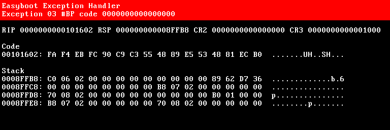
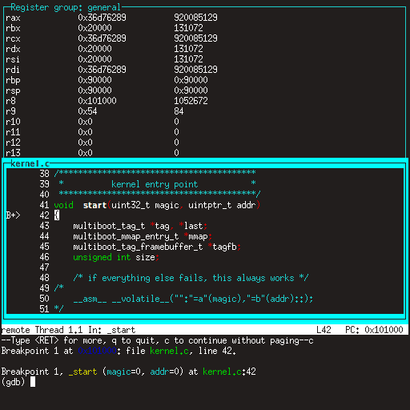

Debugowanie jądra
=================

Jeśli jądro zacznie szwankować, domyślnie **Easyboot** zrobi ci przysługę, wyświetlając szczegóły dotyczące tego, co i gdzie poszło
nie tak.



To wystarczy, aby dać ci wskazówkę, ale nie pozwala ci na interaktywne badanie. Do tego potrzebny jest debuger.

Mini Debugger
-------------

Zalety:

- łatwy w konfiguracji
- łatwy w użyciu
- działa zarówno na prawdziwym sprzęcie, jak i maszynach wirtualnych

Wady:

- jak sama nazwa wskazuje, minimalny zestaw funkcji

Aby włączyć [Mini Debugger](https://gitlab.com/bztsrc/minidbg), wystarczy zainstalować **Easyboot** [wtyczkę](plugins.md) poprzez
skopiowanie odpowiedniego pliku `minidbg_(arch).plg` na partycję rozruchową. To wszystko. Zapewnia interfejs terminala wideo przez
linię szeregową (z 115200 bodów, 8 bitami danych, 1 bitem stopu, bez parzystości).

Do prawdziwego sprzętu podłącz terminal VT100 lub VT220, albo inny komputer, za pomocą kabla szeregowego, na którym uruchomiono
**PuTTY** (Windows) lub **minicom** (Linux).

W przypadku maszyn wirtualnych wystarczy uruchomić qemu z argumentami `-serial stdio`, a będziesz mógł kontrolować debuger z tego
samego okna, którego użyłeś do uruchomienia qemu. Na przykład:

```
qemu-system-x86_64 -serial stdio -hda disk.img
```

Za każdym razem, gdy jądro się zepsuje, natychmiast otrzymasz monit debugera i będziesz mógł zbadać sytuację. W wierszu poleceń
debugera wpisz `?` lub `h`, aby uzyskać pomoc. Aby jawnie wywołać debuger, wstaw `int 3` (bajt 0xCC) do swojego kodu. Sugeruję
dodanie następującej definicji do jądra:

```c
/* x86 */
#define breakpoint __asm__ __volatile__("int $3")
/* ARM */
#define breakpoint __asm__ __volatile__("brk #0")
```

```
Mini debugger by bzt
Exception 03: Breakpoint instruction, code 0
rax: 0000000000000000  rbx: 00000000000206C0  rcx: 000000000000270F
rdx: 00000000000003F8  rsi: 00000000000001B0  rdi: 0000000000102336
rsp: 000000000008FFB8  rbp: 000000000008FFF8   r8: 0000000000000004
 r9: 0000000000000002  r10: 0000000000000000  r11: 0000000000000003
r12: 0000000000000000  r13: 0000000000000000  r14: 0000000000000000
r15: 0000000000000000
> ?
Mini debugger commands:
  ?/h		this help
  c		continue execution
  n		move to the next instruction
  r		dump registers
  x [os [oe]]	examine memory from offset start (os) to offset end (oe)
  i [os [oe]]	disassemble instructions from offset start to offset end
> i pc-1 pc+4
00101601: CC                             int	3
00101602: FA                             cli
00101603: F4                             hlt
00101604: EB FC                          jmp	101602h
00101606: 90                              1 x nop
>
```

Qemu Debugger
-------------

Zalety:

- bez konfiguracji, działa od razu
- wyświetla wewnętrzny stan maszyny, czego nie potrafi żaden inny debugger

Wady:

- naprawdę trudne w użyciu
- działa tylko z maszynami wirtualnymi

Gdy maszyna wirtualna jest uruchomiona, z menu wybierz `View` > `compatmonitor0` lub kliknij okno, aby je uaktywnić, i naciśnij
<kbd>Ctrl</kbd>+<kbd>Alt</kbd>+<kbd>2</kbd> (aby uaktywnić, naciśnij <kbd>Ctrl</kbd>+<kbd>Alt</kbd>+<kbd>G</kbd>).

GDB
---

Zalety:

- w pełni funkcjonalny debugger
- zapewnia wszystkie funkcje, jakie możesz sobie wyobrazić

Wady:

- trudne do skonfigurowania
- działa tylko z maszynami wirtualnymi

Zanim cokolwiek zrobisz, najpierw zmodyfikuj środowisko kompilacji, aby wygenerować dwa pliki jądra. Jeden z symbolami debugowania
i drugi bez. Jest to ważne, ponieważ symbole debugowania mogą łatwo zająć dużo miejsca, prawdopodobnie kilka megabajtów. Najpierw
skompiluj jądro z flagą `-g`. Następnie po zakończeniu kompilacji skopiuj jądro `cp mykernel.elf mykernel_sym.elf` i usuń informacje
debugowania za pomocą `strip mykernel.elf`. Następnie uruchomisz `mykernel.elf` i przekażesz `mykernel_sym.elf` do gdb.

Następnie utwórz skrypt gdb o nazwie `gdb.rc`. Użyj poniższego jako szablonu:

```
target remote localhost:1234
set architecture i386:x86-64
symbol-file mykernel_sym.elf
layout split
layout src
layout regs
break *_start
continue
```

Łączy to gdb z maszyną wirtualną, informuje o typie maszyny, ładuje informacje debugowania, konfiguruje układ, ustawia punkt
przerwania bezpośrednio w punkcie wejścia jądra i na koniec uruchamia maszynę wirtualną.

Po wykonaniu tej konfiguracji możesz rozpocząć debugowanie. Jedna sesja debugowania wygląda tak: w jednym terminalu uruchom qemu z
flagami `-s -S`. Zawiesi się. Na przykład:

```
qemu-system-x86_64 -s -S -hda disk.img
```

Następnie w innym terminalu uruchom gdb za pomocą skryptu, który utworzyliśmy wcześniej:

```
gdb -w -x gdb.rc
```

Powinno to wyświetlić wszystko w jednym oknie, jak na poniższym rysunku:



Jeśli dotarłeś aż tutaj, gratulacje, teraz możesz zacząć prawdziwą pracę nad jądrem!
