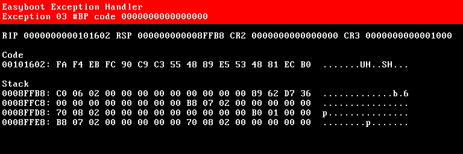
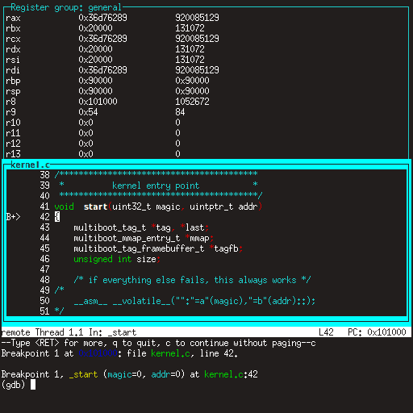

Depurando o seu Kernel
======================

Se o seu kernel apresentar problemas, por defeito o **Easyboot** fará um favor ao exibir detalhes sobre o que e onde correu mal.



Isto é suficiente para lhe dar uma pista, mas não lhe permite investigar interativamente. Para isso, precisaria de um depurador.

Mini Debugger
-------------

Vantagens:

- fácil de configurar
- fácil de usar
- funciona em hardware real e também em máquinas virtuais

Desvantagens:

- como o nome sugere, conjunto mínimo de recursos

Para activar o [Mini Debugger](https://gitlab.com/bztsrc/minidbg), basta instalar o **Easyboot** [plugin](plugins.md) copiando o
ficheiro `minidbg_(arch).plg` apropriado para a sua partição de arranque. É isso. Fornece uma interface de terminal de vídeo por
linha série (com 115200 baud, 8 bits de dados, 1 bit de paragem, sem paridade).

Em hardware real, ligue um terminal VT100 ou VT220, ou outra máquina, através de um cabo série que executa **PuTTY** (Windows)
ou **minicom** (Linux).

Para máquinas virtuais, basta executar o qemu com os argumentos `-serial stdio` e poderá controlar o depurador na mesma janela
que utilizou para executar o qemu. Por exemplo:

```
qemu-system-x86_64 -serial stdio -hda disk.img
```

Sempre que o seu kernel falhar, receberá um aviso do depurador instantaneamente e poderá examinar a situação. No prompt do
depurador, digite `?` ou `h` para obter ajuda. Para invocar explicitamente o depurador, introduza `int 3` (um byte 0xCC) no
seu código. Sugiro que adicione a seguinte definição ao seu kernel:

```c
/* x86 */
#define breakpoint __asm__ __volatile__("int $3")
/* ARM */
#define breakpoint __asm__ __volatile__("brk #0")
```

```
Mini debugger by bzt
Exception 03: Breakpoint instruction, code 0
rax: 0000000000000000  rbx: 00000000000206C0  rcx: 000000000000270F
rdx: 00000000000003F8  rsi: 00000000000001B0  rdi: 0000000000102336
rsp: 000000000008FFB8  rbp: 000000000008FFF8   r8: 0000000000000004
 r9: 0000000000000002  r10: 0000000000000000  r11: 0000000000000003
r12: 0000000000000000  r13: 0000000000000000  r14: 0000000000000000
r15: 0000000000000000
> ?
Mini debugger commands:
  ?/h		this help
  c		continue execution
  n		move to the next instruction
  r		dump registers
  x [os [oe]]	examine memory from offset start (os) to offset end (oe)
  i [os [oe]]	disassemble instructions from offset start to offset end
> i pc-1 pc+4
00101601: CC                             int	3
00101602: FA                             cli
00101603: F4                             hlt
00101604: EB FC                          jmp	101602h
00101606: 90                              1 x nop
>
```

Qemu Debugger
-------------

Vantagens:

- sem configuração, funciona imediatamente
- apresenta o estado interno da máquina, o que nenhum outro depurador consegue fazer

Desvantagens:

- muito difícil de utilizar
- funciona apenas com máquinas virtuais

Quando a sua máquina virtual estiver em execução, no menu seleccione `View` > `compatmonitor0`, ou clique na janela para que esta
tenha o foco e prima <kbd>Ctrl</kbd>+<kbd>Alt</kbd>+<kbd>2</kbd> (para libertar o foco, prima <kbd>Ctrl</kbd>+<kbd>Alt</kbd>+<kbd>G</kbd>).

GDB
---

Vantagens:

- depurador completo
- fornece todos os recursos que possa imaginar

Desvantagens:

- difícil de configurar
- funciona apenas com máquinas virtuais

Antes de fazer qualquer coisa, modifique o seu ambiente de compilação para gerar dois ficheiros kernel. Um com símbolos de depuração
e outro sem. Isto é importante porque os símbolos de depuração podem facilmente ocupar muito espaço, provavelmente vários megabytes.
Primeiro, compile o seu kernel com o sinalizador `-g`. Assim que a compilação estiver concluída, copie o seu kernel
`cp mykernel.elf mykernel_sym.elf` e remova as informações de depuração com `strip mykernel.elf`. Depois disso, irá inicializar
`mykernel.elf` e fornecer `mykernel_sym.elf` ao gdb.

De seguida, crie um script gdb chamado `gdb.rc`. Utilize o seguinte como modelo:

```
target remote localhost:1234
set architecture i386:x86-64
symbol-file mykernel_sym.elf
layout split
layout src
layout regs
break *_start
continue
```

Este liga o gdb à máquina virtual, informa o tipo da máquina, carrega a informação de depuração, configura o layout, define um
ponto de interrupção no ponto de entrada do seu kernel e, finalmente, inicia a máquina virtual.

Após concluir esta configuração, pode iniciar a depuração. Uma sessão de depuração ocorre assim: num terminal, inicie o qemu com
os sinalizadores `-s -S`. Ele vai travar. Por exemplo:

```
qemu-system-x86_64 -s -S -hda disk.img
```

De seguida, noutro terminal, inicie o gdb com o script que criámos anteriormente:

```
gdb -w -x gdb.rc
```

Isto deve exibir tudo numa janela como esta:



Se chegou até aqui, parabéns, pode começar o trabalho a sério com o seu kernel!
